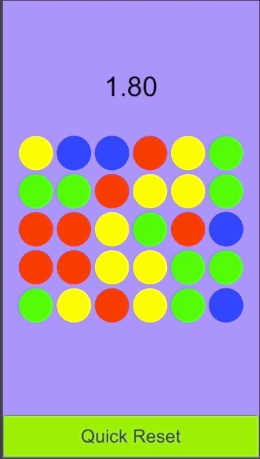

# Match3

 
This is a mobile Match3 Demo game. The objective is to Match as many Gems as possible in the shortest amount of time possible. Players will Touch and Drag a gem to perform Gem swapping.
 
 
This game features the following:
* Touch and Drag mechanics to swap Gems into different positions.
* Matching algorithm to detect when matches are made.
* Includes ability to Respawn Gems and perform cascading matches.
* Records Top 10 High Scores.
* Quick Reset Button to restart the game.
